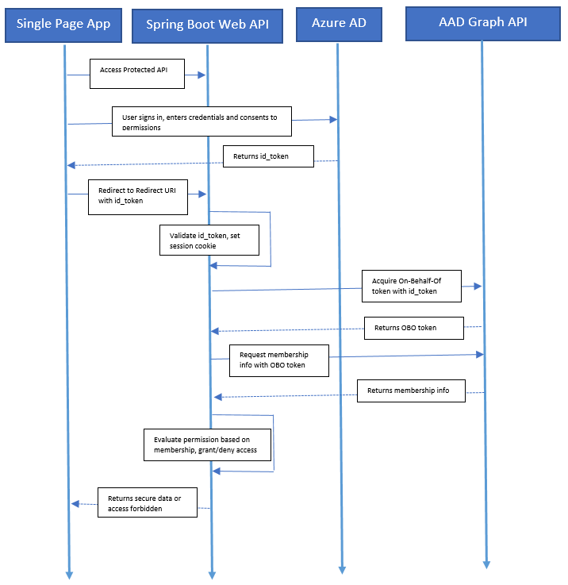

## Overview
This is a pre-release package that enables Spring Security integration with Azure Active Directory for authentication and integration scenarios via OpenID Connect/OAuth 2.0 protocols. Currently it supports the implicit authorization grant, making it ideal for enabling authenticaton and authorization for Single Page Application (SPA) web apps.

### Implementation summary
This package provides a Spring Security filter to validate the Jwt token from Azure AD. The Jwt token is also used to acquire a On-Behalf-Of token for Azure AD Graph API so that authenticated user's membership information is available for authorization of access of API resources. Below is a diagram that shows the layers and typical flow for Single Page Application with Spring Boot web API backend that uses the filter for Authentication and Authorization.
.
### Register the application in Azure AD
* Go to Azure Portal - Azure Active Directory - App registrations - New application registration to register the application in Azure Active Directory.  `Application ID` is `clientId` in `application.properties`.
* After application registration succeeded, go to API ACCESS - Required permissions - DELEGATED PERMISSIONS, tick `Access the directory as the signed-in user` and `Sign in and read user profile`.
* Click `Grant Permissions` (Note: you will need administrator privilege to grant permission).
* Go to API ACCESS - Keys to create a secret key (`clientSecret`).

### Add the dependency

`azure-ad-integration-spring-boot-starter` is published on Maven Central Repository.
If you are using Maven, add the following dependency.

```xml
<dependency>
    <groupId>com.microsoft.azure</groupId>
    <artifactId>azure-ad-integration-spring-boot-starter</artifactId>
    <version>0.1.5</version>
</dependency>
```

### Add application properties

Open `application.properties` file and add below properties.

```
azure.activedirectory.clientId=Application-ID-in-AAD-App-registrations
azure.activedirectory.clientSecret=Key-in-AAD-API-ACCESS
azure.activedirectory.ActiveDirectoryGroups=Aad-groups e.g. group1,group2,group3
```

### Configure WebSecurityConfigurerAdapter class to use `AADAuthenticationFilter`

```
@Autowired
private AADAuthenticationFilter aadAuthFilter;
```

You can refer to [azure-ad-integration-spring-boot-starter-sample](../azure-ad-integration-spring-boot-starter-sample/README.md) for how to integrate Spring Security and Azure AD for authentication and authorization in a Single Page Application (SPA) scenario.
